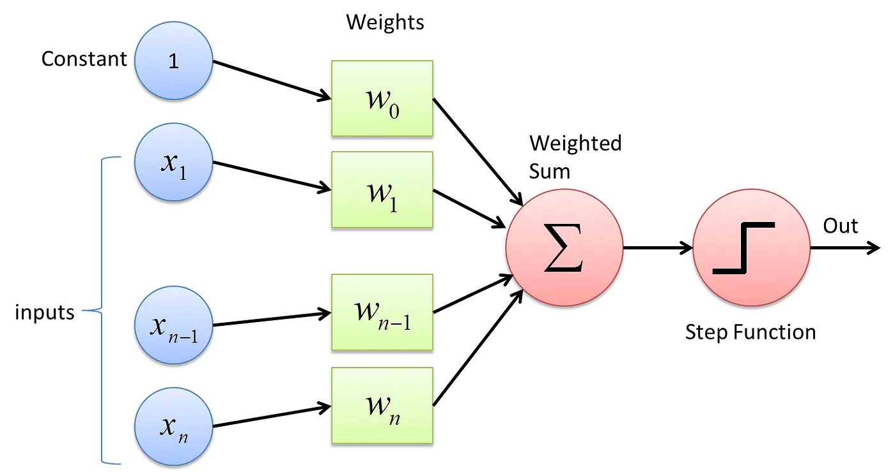
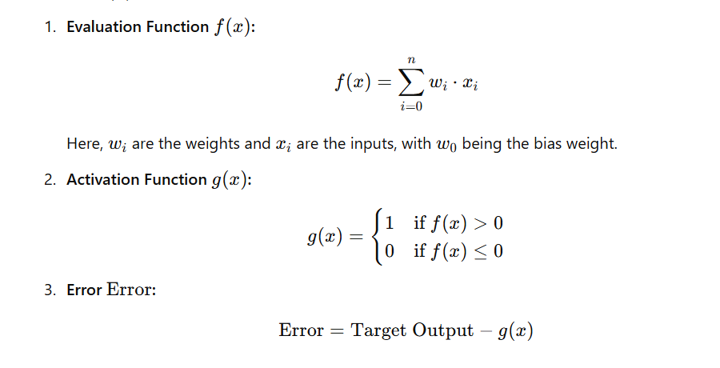
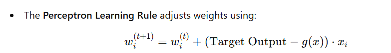
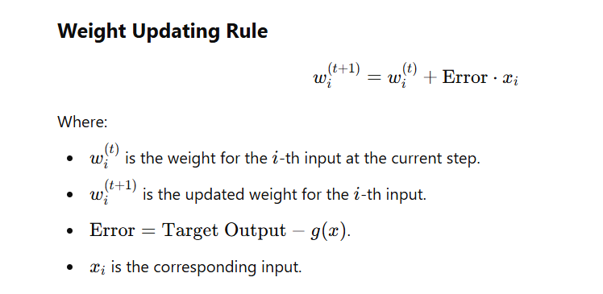
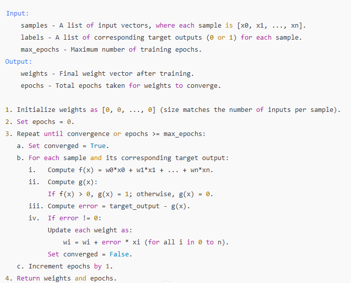
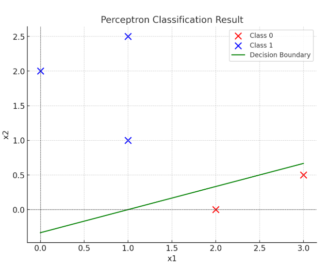

# Concept

# Formuals

# Perceptron Learning Rule (Hebbian Learning Rule)

### Perceptron Weight Adjustment Algorithm (No Learning Rate)

# Example of Applying the Learning Algorithm

## Input

| X0 | X1 | X2 | Y |
|---|---|---|---|
| 1 | 0 | 2 | 1 |
| 1 | 2 | 0 | 0 |
| 1 | 1 | 1 | 1 |
| 1 | 3 | 0.5 | 0 |
| 1 | 1 | 2.5 | 1 |

### Initial weights: [0. 0. 0.]

## Epoch 1:

| Sample     | f(x) | g(x) | Target | Error | Updated Weights |
|------------|-----|---|---|-------|-----------------|
| [1, 0, 2]  | 0   | 0 | 1 | 1     | [1, 0, 2]       |
| [1, 2 , 0] | 1   | 1 | 0 | -1    | [0, -2, 2]      |
| [ 1, 1, 1] | 0   | 0 | 1 | 1     | [1, -1, 3]      |
| [1, 3, 0.5] | -0.5 | 0 | 0 | 0     | [1, -1, 3]      |
| [1, 1, 2.5] | 7.5 | 1 | 1 | 0     | [1, -1, 3]      |

## Epoch 2:

| Sample     | f(x) | g(x) | Target | Error | Updated Weights |
|------------|------|------|---|-------|------------|
| [1, 0, 2]  | 7    | 1    | 1 | 0     | [1, -1, 3] |
| [1, 2 , 0] | -1   | 0    | 0 | 0     | [1, -1, 3] |
| [ 1, 1, 1] | 3    | 1    | 1 | 0     | [1, -1, 3] |
| [1, 3, 0.5] | -0.5 | 0    | 0 | 0     | [1, -1, 3] |
| [1, 1, 2.5] | 7.5  | 1    | 1 | 0     | [1, -1, 3] |

### => Error converged to 0 so the Weights converged.

## Final weights: [ 1. -1.  3.]
## Total epochs: 2

# Boundry

